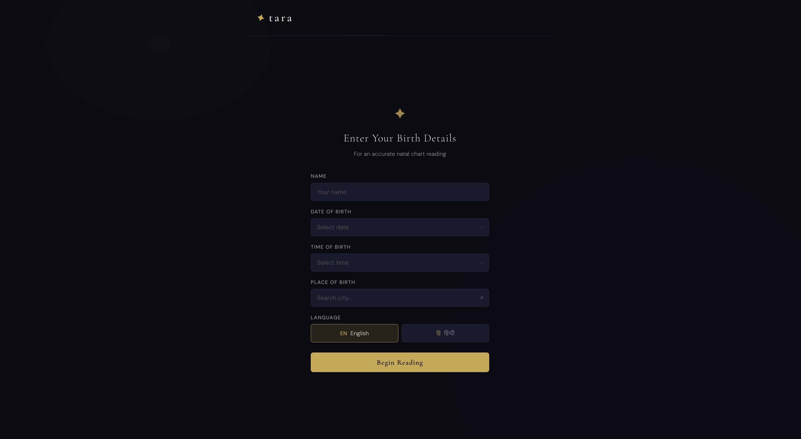
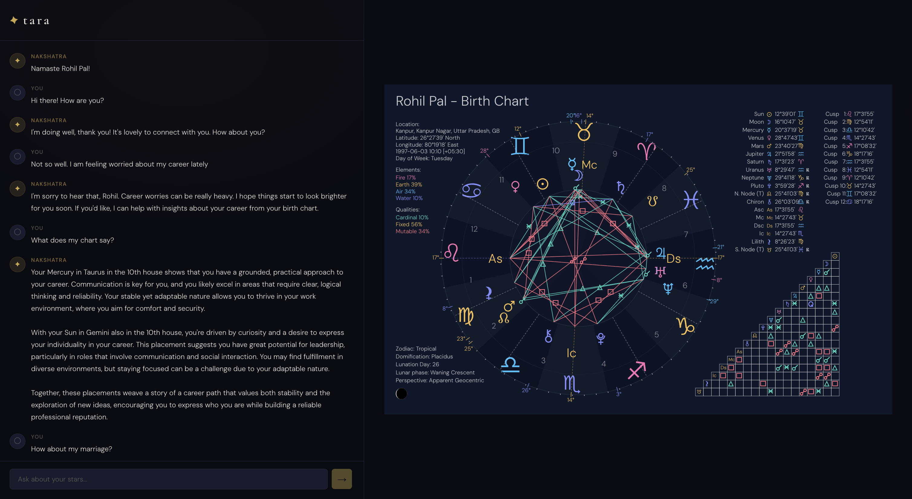

# Tara

A conversational Vedic astrology agent. You give it your birth details, it builds your chart, and then you can chat with it about career, relationships, finances — whatever's on your mind. It remembers context across turns and pulls in astrological knowledge when needed.

<p align="center">
  
  <br>
  <em>Birth details form</em>
</p>

<p align="center">
  
  <br>
  <em>Chat window with rendered birth chart</em>
</p>

## Setup

You need Python 3.11+ and Node.js.

```bash
# Backend
uv sync
cp .env.example .env  # add your OPENAI_API_KEY
uv run uvicorn backend.main:app --reload

# Frontend (separate terminal)
cd frontend
npm install
npm run dev
```

## How it works

| Capability | How |
|---|---|
| **Birth chart computation** | Geocodes birth place, resolves timezone, then uses Kerykeion to compute planetary positions and houses |
| **Personalized responses** | Classifier picks relevant planets/houses for the query, cross-references the chart, and retrieves meanings from ChromaDB |
| **Knowledge grounding (RAG)** | ChromaDB vector store with astrological texts — retrieved only when the query actually needs it |
| **Multi-turn memory** | Rolling LLM-generated summary of conversation + recurring concerns, triggered every N messages *(N can be configured in the backend)* |
| **Hindi + English** | Language preference is passed per request; the agent responds entirely in the chosen language |

### LLMs

All LLM calls use **gpt-4o-mini** via the OpenAI Agents SDK:
- **Main agent** — generates conversational responses, decides when to call tools.
- **Classifier sub-agent** — classifies user messages by astrological domain and identifies relevant planets/houses.
- **Memory summarizer** — produces rolling conversation summaries (called directly via the OpenAI API, not as an agent).

### Tools

The main agent has two tools it can call during a conversation. Both use ChromaDB with metadata filtering for targeted search.

**`get_chart_context`** — Personalized chart analysis. A classifier sub-agent first identifies the astrological domain (career, love, health, money etc) and relevant planets/houses from the user's message. These are then resolved against the user's birth chart to get actual placements (e.g. "Mars in Aries in the 7th house"), and the meanings of each entity are retrieved from the vector store. The formatted context is returned to the main agent to ground its response.

> *Example:* "How will my career be this year?" → classifies as career domain, resolves career-relevant planets and houses from the user's chart, retrieves their meanings.

**`retrieve_astrology_knowledge`** — General astrological knowledge lookup. Used when the user asks about the meaning of astrological concepts without needing their personal chart context.

> *Example:* "What does Saturn represent in Vedic astrology?" → directly retrieves the meaning of Saturn from the vector store.

### Memory (Experimental)

Every N user messages, a background task takes the existing memory plus the last 2N messages (N user + N assistant) and re-summarizes them into two fields:
- **`user_concerns`** — recurring topics the user keeps asking about (max 5). The summarizer LLM is prompted to merge similar concerns and drop resolved ones, but this is best-effort since it depends on the LLM's judgement.
- **`conversation_summary`** — a 2-3 sentence summary of what's been discussed so far.

This memory is persisted to disk as JSON and injected into the main agent's system prompt on subsequent turns so it has conversational continuity.

## API

Two endpoints plus a health check.

### `POST /create_astro_chart`

Creates a session, computes the birth chart, and returns an SVG of the chart that gets rendered on the UI.

**Request:**

```json
{
  "user_profile": {
    "name": "Ritika",
    "birth_date": "1995-08-20",
    "birth_time": "14:30",
    "birth_place": "Jaipur, India",
    "preferred_language": "hi"
  }
}
```

**Response:**

```json
{
  "session_id": "abc-123",
  "chart_svg": "<svg>...</svg>",
  "zodiac": "Leo",
  "greeting": "Namaste Ritika!"
}
```

### `POST /chat`

Send messages and get astrological responses within an existing session. Birth details and chart data are stored server-side in the session — only the `session_id` is needed to reference them.

**Request:**

```json
{
  "session_id": "abc-123",
  "message": "I am worried about my relationship lately. Can you tell me what are my stars saying?",
  "preferred_language": "en"
}
```

**Response:**

```json
{
  "session_id": "abc-123",
  "response": "Rohil, your Venus in Gemini in the Eleventh House speaks to the importance of communication and social connections in your romantic life...",
  "zodiac": "Gemini",
  "context_used": ["house_meanings.json", "planet_meanings.json", "zodiac_sign_meanings.json"],
  "retrieval_used": true
}
```

### `GET /health`

Returns service status.

## Project Structure

```
mynaksh/
├── backend/
│   ├── main.py                 # FastAPI app, endpoints
│   ├── astrology_engine.py     # Birth chart computation (Kerykeion)
│   ├── chart_context.py        # Extracts relevant chart features per query
│   ├── llm_agent.py            # LLM agent orchestration
│   ├── memory.py               # Conversation summarization
│   ├── prompts.py              # System prompts and classifiers
│   ├── retrieval.py            # ChromaDB vector search
│   ├── schemas.py              # Pydantic request/response models
│   ├── session_manager.py      # Session state management
│   └── tools.py                # Agent tool definitions
├── frontend/                   # React + Vite app
├── data/
│   ├── house_meanings.json
│   ├── planet_meanings.json
│   ├── zodiac_sign_meanings.json
│   ├── career_guidance.txt      # Not currently used
│   ├── love_guidance.txt        # Not currently used
│   └── spiritual_guidance.txt   # Not currently used
├── chroma_db/                  # Persisted vector store
├── docs/                       # App screenshots
├── pyproject.toml
└── .env.example
```

## Stack

- **Backend**: FastAPI + OpenAI Agents SDK (gpt-4o-mini)
- **Frontend**: React + Vite
- **Vector store**: ChromaDB
- **Astro engine**: [Kerykeion](https://kerykeion.net/)

## Limitations

1. **No context window trimming** — conversation history grows unbounded; no truncation or token-limit management yet.
2. **Agent doesn't ask follow-up questions** — currently the agent only answers user queries. It should proactively ask clarifying questions to give better responses.
3. **Memory underutilized** — last-N-message summarization is implemented, but the agent doesn't check memory before making tool calls. If chart context for certain planets/houses is already in the summary, it could skip redundant lookups.
